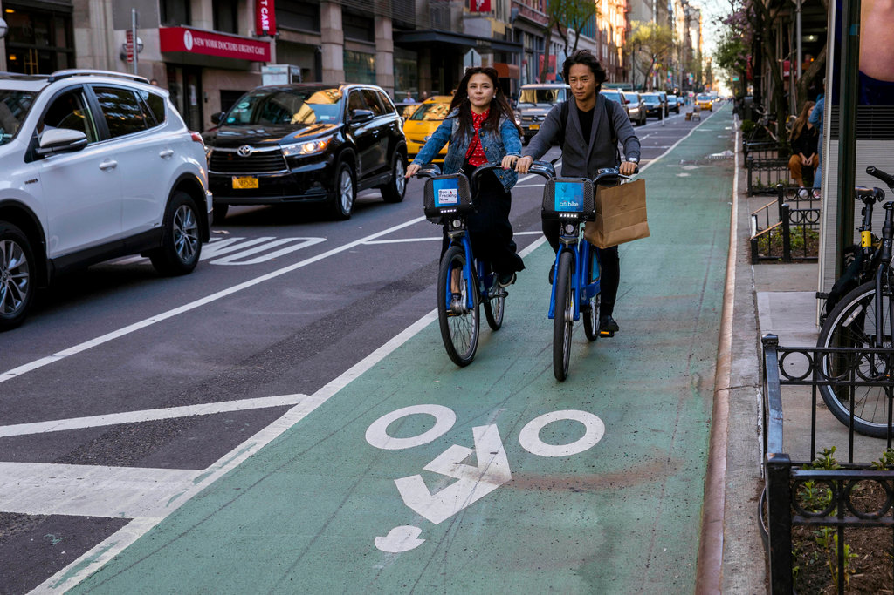
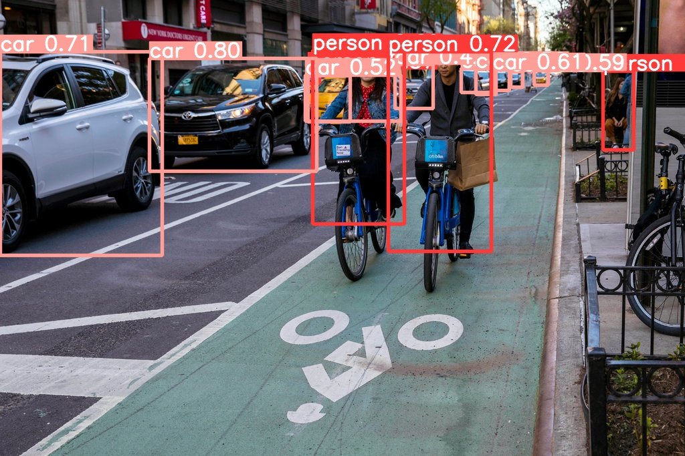

# yolov5_car_person_detection

Model trained using 1739 train images and 500 test images.

Converted coco label format to yolo(darknet) format using this frageneral_json2yolo.py in [here](https://github.com/ultralytics/JSON2YOLO)

Model trained on YOLOv5l pretrained model.

No of epochs for training the model: 4

Model performance on validation dataset:

    Class     Images    Labels        Precision          Recall
 
    all        501       4003          0.748              0.696 

    person     501       2654          0.744              0.668

    car        501       1349          0.752              0.725
   
Trained model can be downloaded from this [link](https://drive.google.com/file/d/15jaM1af6I4BDYbGpOaNFewa5hUdO7iOr/view?usp=sharing)
   
install packages required :

    pip install -r requirements.txt

To run inference :

    python detect.py --source check.jpg --weights last.pt

The output image will be saved as result.jpg

<h1>Sample image</h1>

<h1>Output image</h1>

